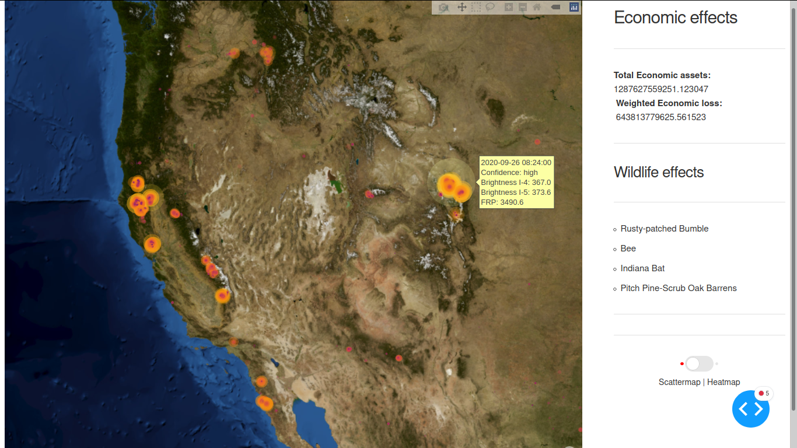
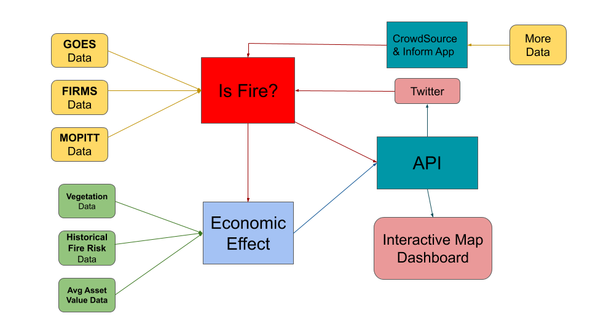

# NASA-Space-Apps-Spot-The-Fire-v3.0

Using each and every possible tool at our disposal to extract wildfire information and spot them early on while estimating the increasing damages caused by delays.

#### [Submission Video](https://www.youtube.com/watch?v=quUQmvZF4eE&feature=youtu.be)

### How We Addressed This Challenge

__Our earth has had a lot of climatic problems on it because of our actions.__

In the USA, 85% of fires are caused due to arson, which, apart from having carbon emissions and helping increase the very real problem of global warming directly, also reduces the number of trees which are our main hope to overcome that problem and this is all disregarding the tons of economic damage to property and usable land and also the danger we put some of the endangered species we have in those areas.

The reason we opted for this problem is mainly this. At the current rate our future generations won't know about Antarctica, probably won't even be able to survive, so with the help of our solution, we will be able to quickly inform and help to pacify wildfires or fires in general, since we can not only get data from multiple geostationary satellites and use our own ML models to give a more confirmed prediction, but also get data and updates from the people near such fires to report it instantly.

_We also can show where the firemen should start extinguishing it from to minimize spread and damage and which are the least risk areas near the fire where animal rescuers can try to evacuate animals from._

This will not only reduce the environmental and economical damage, but will help in protecting flora and fauna which will help in undoing the collective wrongs we have done on this earth and even though in a small manner, help to solidify a better and healthier future for our future generations.

We majorly rely on satellite data to spot fires. NASA uses the raw data from the GOES satellites to calculate the fire risks algorithmically. __We use the same but as input channels for a neural network.__

With those features + CO emissions data from MOPITT + FIRMS data, it's bound to perform good.

We also use NLP to extract location data from latest tweets and news sources.

_Combining these to provide a centralized interface for most fire information._

